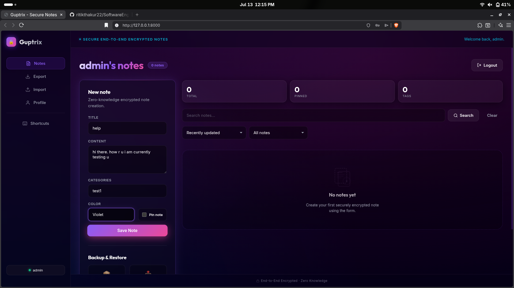
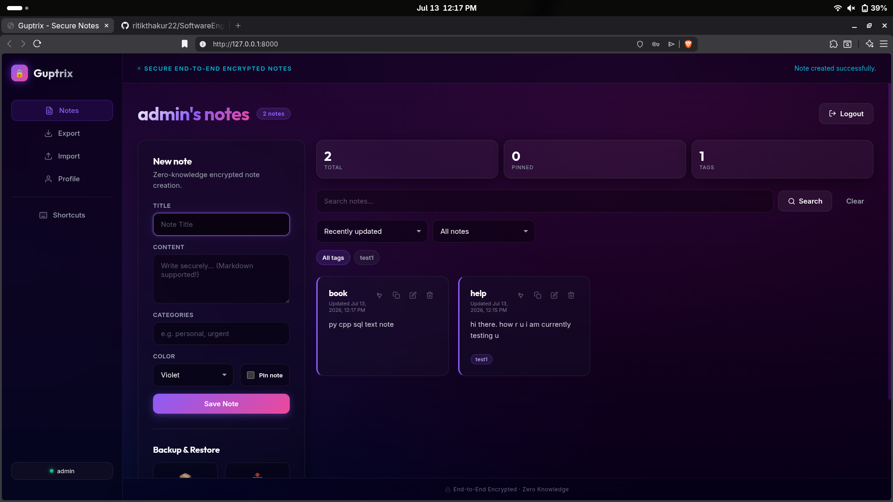
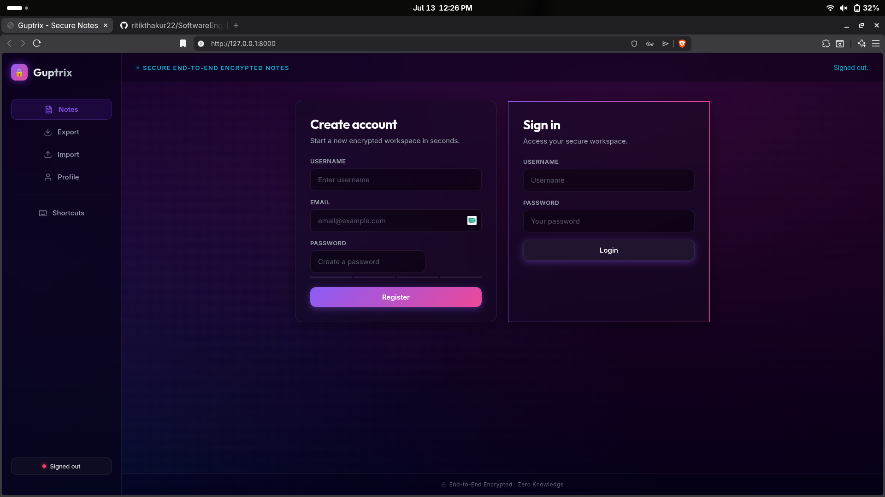
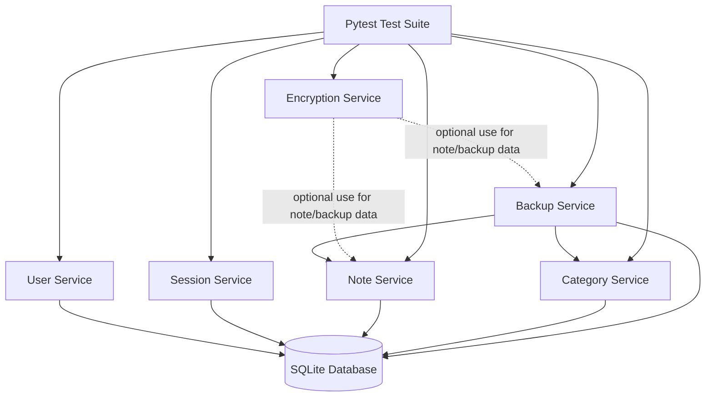

# Guptrix Secure Notes

A lightweight, zero-knowledge, end-to-end encrypted notes application featuring a sleek, modern UI. Built with a Python/Flask backend and a premium glassmorphic frontend.

## Features
- **Advanced UI**: Premium dark mode, animated gradient backgrounds, glassmorphic panels, and neon glow accents.
- **Secure Architecture**: SQLite-backed services for user registration, session management, and encrypted notes.
- **Note Management**: Create, edit, delete, and categorize notes securely.
- **API-First**: Frontend communicates entirely via minimal REST APIs (`/api/*`).

## Screenshots

<div style="display: flex; gap: 10px; overflow-x: auto;">
  
  
  
</div>

## Project Structure

- `user.py`: user registration, login, and profile updates
- `session.py`: session creation, validation, and termination
- `note.py`: note CRUD and search
- `category.py`: category creation and note-category mapping
- `backup.py`: export/import notes as JSON
- `encryptionService.py`: reversible string encryption helper
- `database.py`: SQLite schema and connection helpers
- `app.py`: Flask application serving APIs
- `data/`: local SQLite databases (`notes_app.db` is the active app database)
- `docs/`: supporting project documentation
- `www/`: Advanced glassmorphic frontend static files (HTML, CSS, JS)
- `tests/`: unit, integration, and system tests
- `.github/workflows/python-tests.yml`: CI test workflow

## Default Credentials

When running the application locally or in a fresh deployment, the following default accounts are seeded for testing purposes:

| Role  | Username | Email               | Password  |
| ----- | -------- | ------------------- | --------- |
| Admin | `admin`  | `admin@example.com` | `admin123`|
| Test  | `test`   | `test@example.com`  | `test123` |

## Requirements

- Python 3.12+ (3.14 works in your current setup)
- pytest
- Flask
- gunicorn (for production)

## Local Setup & Development

From project root:

```bash
cd /home/crdy/testing/SE_lab/gupt_site
guptrix/bin/python -m pip install -r requirements.txt
guptrix/bin/python app.py
```

Then open your browser at http://localhost:8000.

## Production Hosting

To host Guptrix in a production environment, you should use a production WSGI server like `gunicorn` rather than the built-in Flask development server.

### 1. Install Production Dependencies
```bash
cd /home/crdy/testing/SE_lab/gupt_site
guptrix/bin/python -m pip install gunicorn
```

### 2. Run with Gunicorn
Start the server binding to `0.0.0.0` (all network interfaces) on your desired port (e.g., 8000) with 4 worker processes:
```bash
cd /home/crdy/testing/SE_lab/gupt_site
guptrix/bin/gunicorn -w 4 -b 0.0.0.0:8000 app:app
```

*Note: For public internet access, it's recommended to place a reverse proxy like Nginx in front of Gunicorn to handle SSL/TLS termination.*

## Run Tests

### Unit tests

```bash
cd /home/crdy/testing/SE_lab/gupt_site
guptrix/bin/python -m pytest -q tests/test_*_unit.py
```

### Integration test

```bash
cd /home/crdy/testing/SE_lab/gupt_site
guptrix/bin/python -m pytest -q tests/test_integration_flow.py
```

### System test

```bash
cd /home/crdy/testing/SE_lab/gupt_site
guptrix/bin/python -m pytest -q tests/test_system_flow.py
```

### Full suite

```bash
cd /home/crdy/testing/SE_lab/gupt_site
guptrix/bin/python -m pytest -q tests/test_*_unit.py tests/test_integration_flow.py tests/test_system_flow.py
```

## Architecture Diagram



This project follows a service-style design where each module encapsulates one responsibility and persists to the shared SQLite schema in `database.py`.

## Troubleshooting

### 1) ModuleNotFoundError: No module named 'backup'
Run tests through pytest from project root.

### 2) Foreign key or data conflicts during manual runs
Use temporary DB fixtures for tests (already configured), or delete/reset your manual DB file before rerunning flows.
